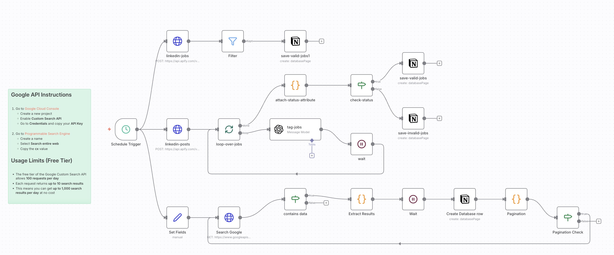

# Personal Job Scraper (n8n Workflow)

An **n8n automation workflow** that scrapes **LinkedIn job listings and hiring-related posts** to identify relevant roles to apply for, filter them based on custom rules, and store qualified opportunities for tracking.

## Table of Contents

* [About the Project](#about-the-project)
* [Features](#features)
* [Workflow Overview](#workflow-overview)
* [Built With](#built-with)
* [Getting Started](#getting-started)
* [Configuration](#configuration)
* [Usage](#usage)
* [Limitations](#limitations)
* [License](#license)

## About the Project

This workflow automates job discovery by scraping LinkedIn job listings and hiring posts using third-party scraping APIs. It filters roles based on seniority, keywords, location constraints, and exclusion rules, then saves valid jobs to a Notion database for review and application tracking.

The goal is to eliminate manual job searching and surface only high-quality, relevant opportunities.

## Features

* Scrapes LinkedIn **job listings** and **hiring posts**
* Filters out invalid roles, locations, and seniority levels
* Supports pagination and scheduled runs
* Classifies jobs as **valid** or **invalid**
* Stores results in **Notion** for tracking
* Fully modular and extensible n8n workflow

## Workflow Overview

1. Scheduled trigger runs daily
2. LinkedIn jobs and posts are scraped via Apify
3. Results are filtered using rule-based + LLM validation
4. Valid jobs are saved to Notion
5. Invalid roles are logged separately

## Built With

* **n8n**
* **Apify (LinkedIn scrapers)**
* **OpenAI (job validation)**
* **Google Custom Search API**
* **Notion API**

## Getting Started

### Prerequisites

* n8n instance (self-hosted or cloud)
* Apify API key
* OpenAI API key
* Google Custom Search API credentials
* Notion integration + database

### Installation

1. Clone the repository
2. Import the workflow JSON into n8n
3. Configure credentials inside n8n
4. Update filters and keywords as needed

## Configuration

You can customize:

* Job titles and keywords
* Valid and invalid locations
* Experience levels
* Scheduling frequency
* Storage destination (Notion, DB, Sheets)

## Usage

Once activated, the workflow runs automatically on schedule and continuously updates your job database with new, relevant opportunities ready for application.

## Limitations

* Relies on third-party scraping APIs
* Subject to LinkedIn content availability and API limits
* Intended for personal or internal use

